# 📚 BitLibro API

**BitLibro** es una aplicación Fullstack RESTful desarrollada en **.NET 8** con **SQL Server** que permite gestionar préstamos de libros mediante un sistema basado en roles: `Admin`, `Employee` y `Client`.

## 🚀 Tecnologías utilizadas

- .NET 8
- Entity Framework Core (EF Core)
- SQL Server
- ASP.NET Core Identity
- JWT (JSON Web Tokens)
- FluentValidation
- Swagger (Swashbuckle)

## 📦 Paquetes NuGet

```xml
<PackageReference Include="FluentValidation.AspNetCore" Version="11.3.1" />
<PackageReference Include="FluentValidation.DependencyInjectionExtensions" Version="12.0.0" />
<PackageReference Include="Microsoft.AspNetCore.Authentication.JwtBearer" Version="8.0.17" />
<PackageReference Include="Microsoft.AspNetCore.Identity.EntityFrameworkCore" Version="8.0.17" />
<PackageReference Include="Microsoft.EntityFrameworkCore.Design" Version="9.0.6" />
<PackageReference Include="Microsoft.EntityFrameworkCore.SqlServer" Version="9.0.6" />
<PackageReference Include="Microsoft.EntityFrameworkCore.Tools" Version="9.0.6" />
<PackageReference Include="Swashbuckle.AspNetCore" Version="6.6.2" />
```

## 🧑‍🤝‍🧑 Roles definidos

- Admin.
- Employee.
- Client.

## 🔐 Base de datos

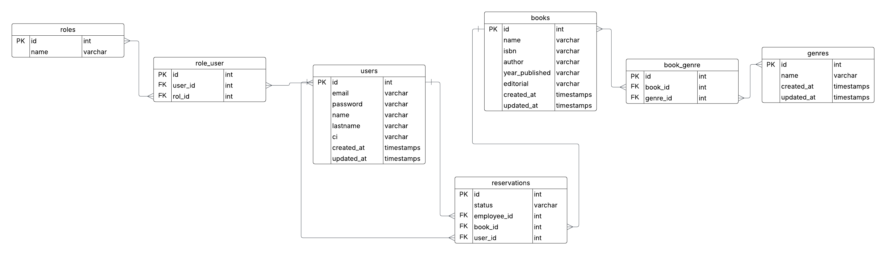

## 🔐 Módulo de Autenticación

Incluye los siguientes endpoints:

- `POST /api/auth/login`: Inicio de sesión con validación usando FluentValidation.
- `POST /api/auth/logout`: Cierre de sesión.
- `GET /api/auth/me`: Obtención de información del usuario autenticado.

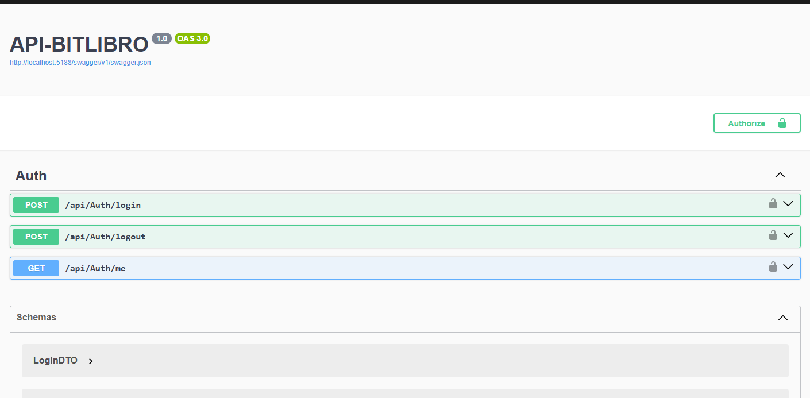

### 🔐 Endpoints principales

### 📌 Módulo Auth (/api/auth)

| Método | Ruta               | Descripción                       | Requiere JWT |
| ------ | ------------------ | --------------------------------- | ------------ |
| POST   | `/api/auth/login`  | Login de usuario                  | ❌           |
| POST   | `/api/auth/logout` | Cerrar sesión (invalida el token) | ✅           |
| GET    | `/api/auth/me`     | Obtener datos del usuario actual  | ✅           |

### Digrama de caso de uso

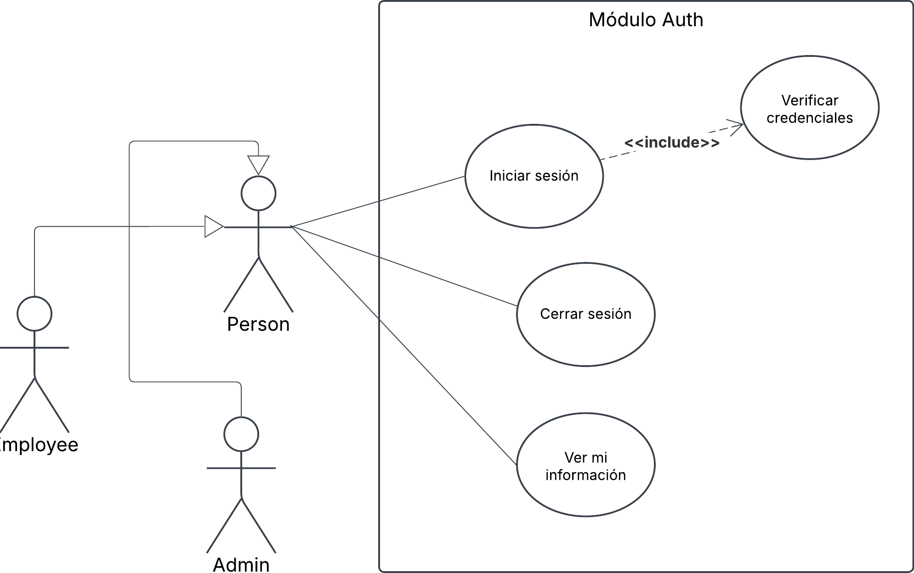

## 👻 Módulo de Géneros

Incluye los siguientes endpoints:

- `GET /api/genres`: Ver géneros (se puede filtar por Name y paginar con Page - PageSize ).
- `GET /api/genres/{id}`: Ver un género.
- `POST /api/genres`: Crear género con validación usando FluentValidation.
- `PUT /api/genres/{id}`: Editar género con validación usando FluentValidation.
- `DELETE /api/genres/{id}`: Eliminar género.


### 🔐 Endpoints principales

### 📌 Módulo Género (/api/genres)

| Método | Ruta               | Descripción        | Requiere JWT | Admin | Employee |
| ------ | ------------------ | ------------------ | ------------ | ----- | -------- |
| GET    | `/api/genres/`     | Ver géneros        | ✅           | ✅    | ❌       |
| GET    | `/api/genres/{id}` | Ver un género      | ✅           | ✅    | ❌       |
| POST   | `/api/genres/`     | Crear género       | ✅           | ✅    | ❌       |
| PUT    | `/api/genres/{id}` | Editar un género   | ✅           | ✅    | ❌       |
| DELETE | `/api/genres/{id}` | Eliminar un género | ✅           | ✅    | ❌       |

### Digrama de caso de uso

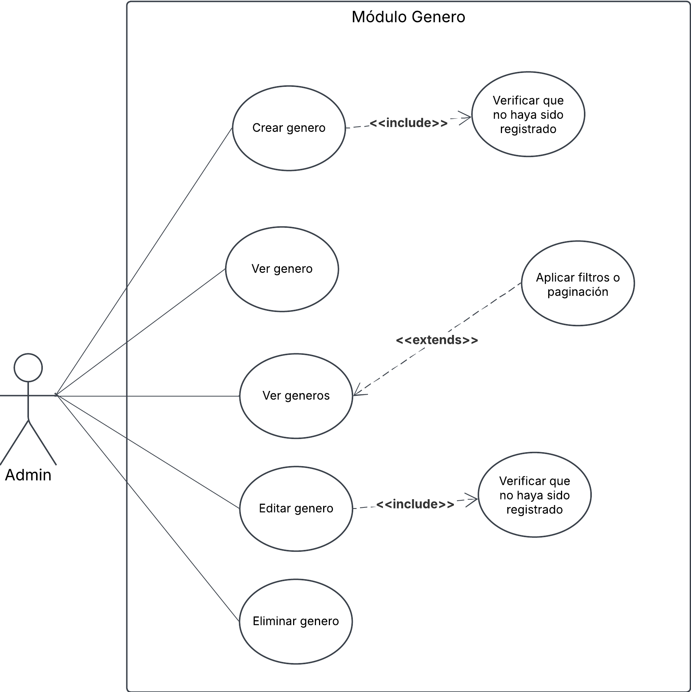

## 📌 Módulo de Empleados

Incluye los siguientes endpoints:

- `GET /api/employees`: Ver empleados (se puede filtar por Name, LastName y paginar con Page - PageSize ).
- `GET /api/employees/{id}`: Ver un empleado .
- `GET /api/employees/{id}/reservations`: Ver reservas realizadas por un empleado (se puede filtar por ClientName, Status y paginar con Page - PageSize ) .
- `POST /api/employees`: Crear empleado con validación usando FluentValidation.
- `PUT /api/employees/{id}`: Editar empleado con validación usando FluentValidation.
- `DELETE /api/employees/{id}`: Eliminar empleado.

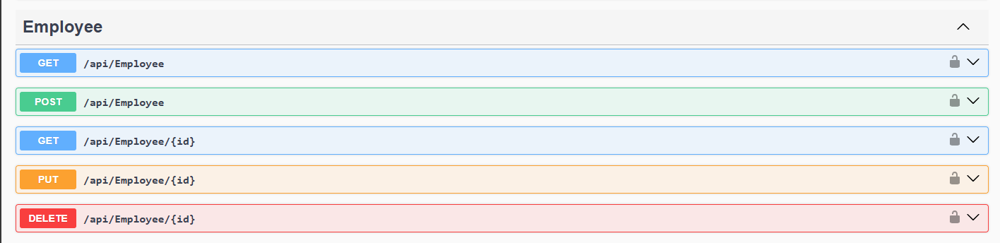

### 🔐 Endpoints principales

### 📌 Módulo Empleado (/api/employees)

| Método | Ruta                               | Descripción                              | Requiere JWT | Admin | Employee |
| ------ | ---------------------------------- | ---------------------------------------- | ------------ | ----- | -------- |
| GET    | `/api/employees/`                  | Ver empleado                             | ✅           | ✅    | ❌       |
| GET    | `/api/employees/{id}`              | Ver un empleado                          | ✅           | ✅    | ❌       |
| GET    | `/api/employees/{id}/reservations` | Ver reservaciones hechas por un empleado | ✅           | ✅    | ❌       |
| POST   | `/api/employees/`                  | Crear empleado                           | ✅           | ✅    | ❌       |
| PUT    | `/api/employees/{id}`              | Editar un empleado                       | ✅           | ✅    | ❌       |
| DELETE | `/api/employees/{id}`              | Eliminar un empleado                     | ✅           | ✅    | ❌       |

### Digrama de caso de uso

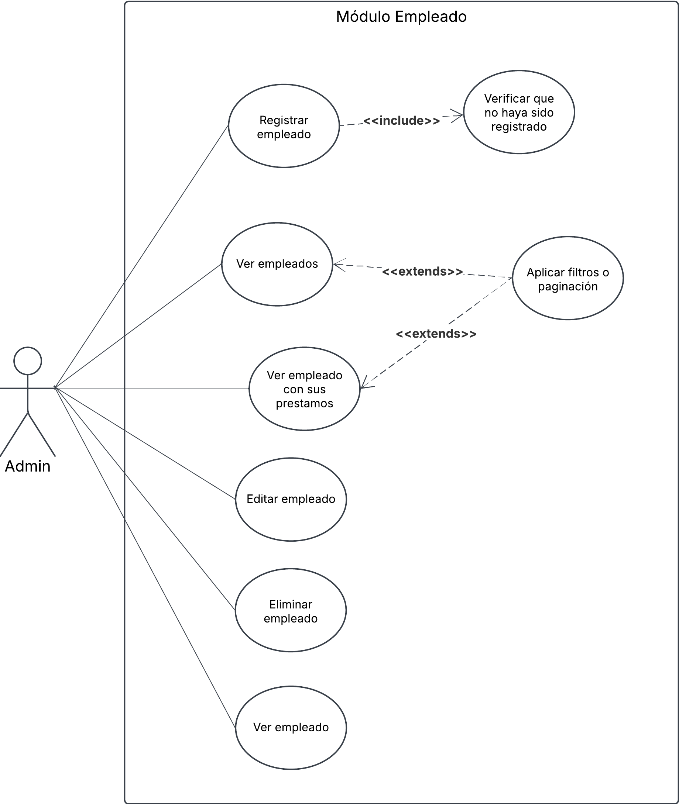

## 📌 Módulo de Libros

Incluye los siguientes endpoints:

- `GET /api/books` - Listar libros (con filtros por Name, Author, ISBN, GenreId. Paginar con Page - PageSize por defecto de 10) --> (Admin, Employee)
- `GET /api/books/{id}` - Obtener libro por ID (Admin, Employee)
- `POST /api/books` - Crear libro (Admin)
- `PUT /api/books/{id}` - Actualizar libro (Admin) si se suben imágenes al editar, se eliminan las actuales y se intercambian por las nuevas
- `DELETE /api/books/{id}` - Eliminar libro (Admin)

**Imágenes**:

- `DELETE /api/books/{bookId}/images/{imageId}` - Eliminar imagen específica (Admin)
- `DELETE /api/books/{bookId}/images` - Eliminar todas las imágenes de un libro (Admin)

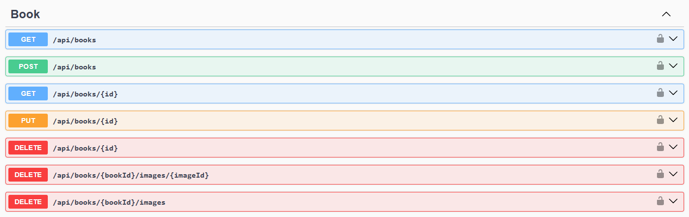

### 🔐 Endpoints principales

### 📌 Módulo Libros (/api/books)

| Método | Ruta                                   | Descripción                             | Requiere JWT | Admin | Employee |
| ------ | -------------------------------------- | --------------------------------------- | ------------ | ----- | -------- |
| GET    | `/api/books/`                          | Ver libros                              | ✅           | ✅    | ✅       |
| GET    | `/api/books/{id}`                      | Ver un libro                            | ✅           | ✅    | ✅       |
| POST   | `/api/books/`                          | Crear libro                             | ✅           | ✅    | ❌       |
| PUT    | `/api/books/{id}`                      | Editar un libro                         | ✅           | ✅    | ❌       |
| DELETE | `/api/books/{id}`                      | Eliminar un libro                       | ✅           | ✅    | ❌       |
| DELETE | `/api/books/{bookId}/images/{imageId}` | Eliminar imagen específica              | ✅           | ✅    | ❌       |
| DELETE | `/api/books/{bookId}/images`           | Eliminar todas las imágenes de un libro | ✅           | ✅    | ❌       |

### Digrama de caso de uso

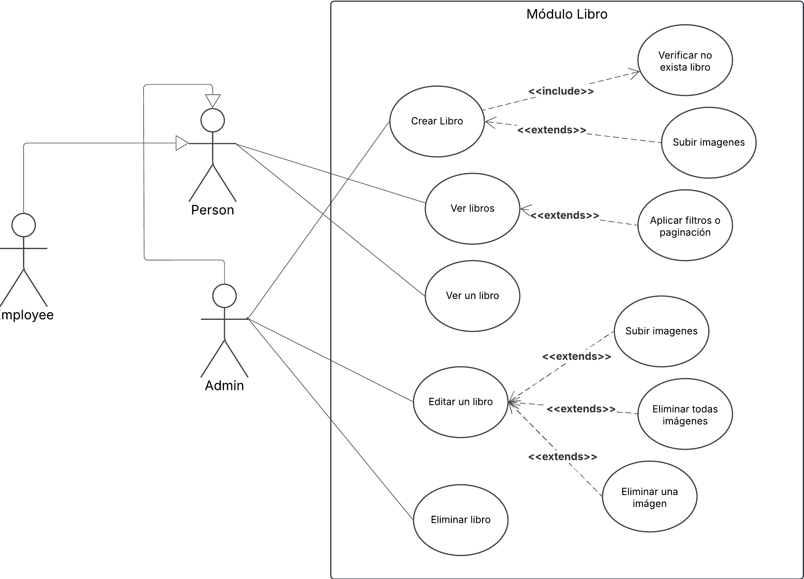

## 📌 Módulo de Préstamos

Incluye los siguientes endpoints:

- `GET /api/reservations` - Listar reservaciones (con filtros por ClientName, EmployeeName, Status. Paginar con Page - PageSize por defecto de 10) si soy admin se muestran todas las reservaciones, en caso de ser empleado se muestran solo las reservaciones que he realizado --> (Admin, Employee)
- `GET /api/reservations/{id}` - Obtener reservación por ID (Admin y Employee) en el caso de Employee es siempre y cuando la reservación la haya hecho el Employee ---> (Admin, Employee)
- `POST /api/reservations` - Crear Reservación (Employee)
- `PUT /api/reservations/{id}` - Actualizar reservación (Admin y Employee)

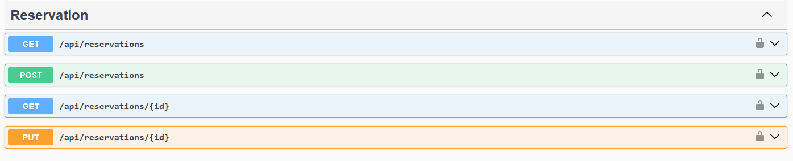

### 🔐 Endpoints principales

### 📌 Módulo Préstamos (/api/reservations)

| Método | Ruta                     | Descripción            | Requiere JWT | Admin | Employee |
| ------ | ------------------------ | ---------------------- | ------------ | ----- | -------- |
| GET    | `/api/reservations/`     | Listar reservaciones   | ✅           | ✅    | ✅       |
| GET    | `/api/reservations/{id}` | Ver una reservación    | ✅           | ✅    | ✅       |
| POST   | `/api/reservations/`     | Crear reservación      | ✅           | ❌    | ✅       |
| PUT    | `/api/reservations/{id}` | Editar una reservación | ✅           | ✅    | ✅       |

### Digrama de caso de uso

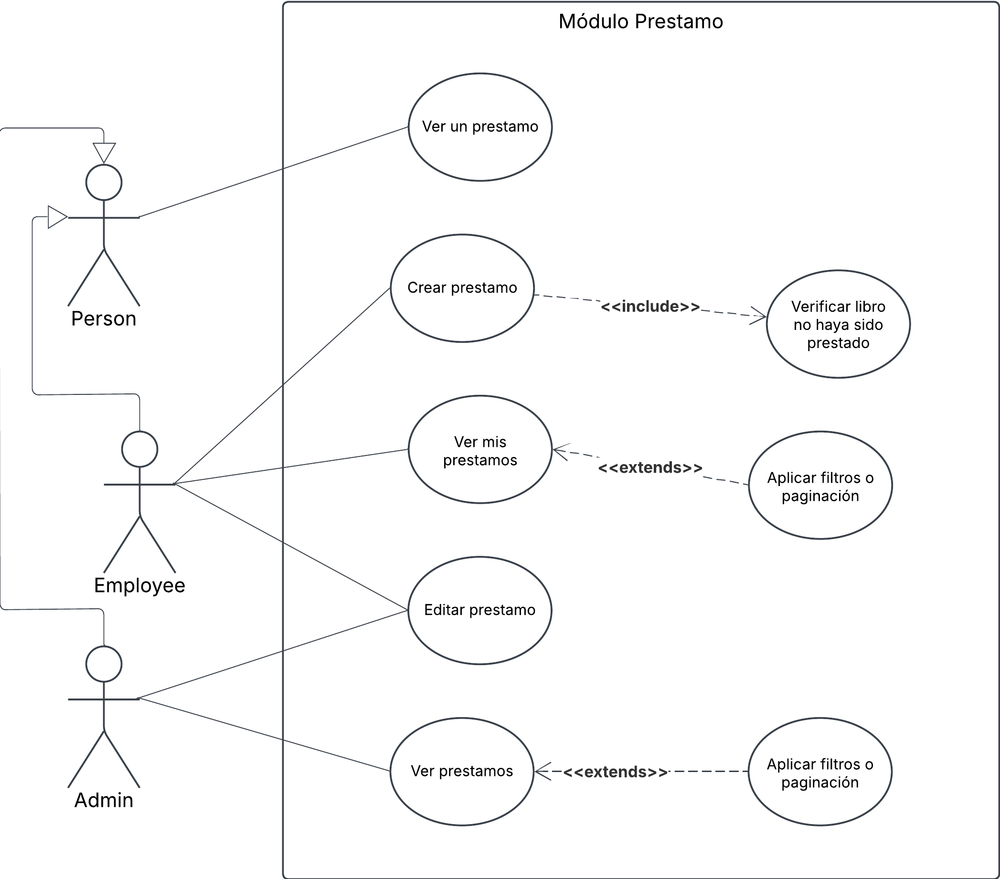

## 👥 Módulo de Clientes

Incluye los siguientes endpoints:

- `GET /api/clients` - Listar clientes (con filtros por EmployeeName, Status. Paginar con Page - PageSize por defecto de 10) --> (Admin, Employee)
- `GET /api/clients/{id}` - Obtener cliente por ID (Admin)
- `GET /api/clients/{id}/reservations` - Obtener todas las reservaciones de un cliente por ID (con filtros por EmployeeName, Status. Paginar con Page - PageSize por defecto de 10) --> (Admin)

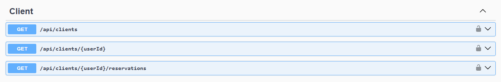

### 🔐 Endpoints principales

### 📌 Módulo Clientes (/api/clients)

| Método | Ruta                             | Descripción                     | Requiere JWT | Admin | Employee |
| ------ | -------------------------------- | ------------------------------- | ------------ | ----- | -------- |
| GET    | `/api/clients/`                  | Listar clientes                 | ✅           | ✅    | ✅       |
| GET    | `/api/clients/{id}`              | Ver un cliente                  | ✅           | ✅    | ❌       |
| POST   | `/api/clients/{id}/reservations` | Ver reservaciones de un cliente | ✅           | ✅    | ❌       |

### Digrama de caso de uso

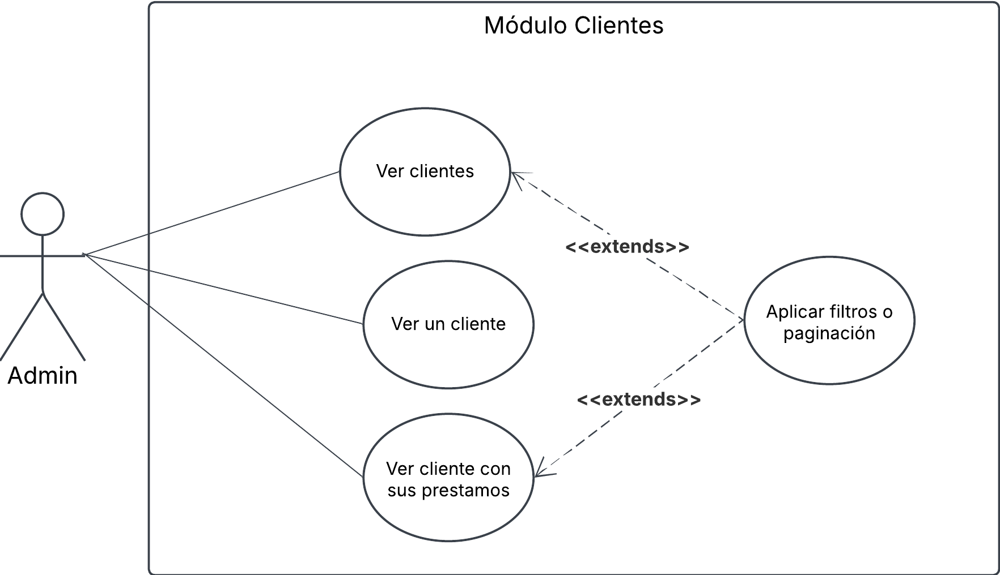

## ✅ Pruebas Manuales y Automáticas Realizadas

### 🔐 Módulo de Autenticación

`POST /api/auth/login`

- [✔️] Errores de validación (campos requeridos vacíos)
- [✔️] Credenciales inválidas (email o contraseña incorrecta)
- [✔️] Login exitoso con token JWT retornado

`POST /api/auth/logout`

- [✔️] Logout exitoso (token invalidado)
- [✔️] Acceso no autenticado (401)

`GET /api/auth/me`

- [✔️] Usuario autenticado recibe su información correctamente
- [✔️] Usuario no autenticado recibe error 401

### 🧩 Módulo de Géneros

`GET /api/genres/{id}`

- [✔️] Género encontrado exitosamente

- [✔️] Género no encontrado (404)

`POST /api/genres`

- [✔️] Género ya existente (409 o validación fallida)

- [✔️] Errores de validación (nombre vacío o muy corto)

- [✔️] Creación exitosa

`PUT /api/genres/{id}`

- [✔️] Género ya en uso (conflicto)

- [✔️] Errores de validación

- [✔️] Actualización exitosa

`DELETE /api/genres/{id}`

- [✔️] Eliminado exitosamente

- [✔️] Género no encontrado (404)

### 👥 Módulo de Empleados

`GET /api/employees/{id}`

- [✔️] Empleado existente retornado correctamente

- [✔️] Empleado no encontrado

`GET /api/employees/{id}/reservations`

- [✔️] Empleado existente retornado correctamente paginados filtros

- [✔️] Empleado no encontrado

`POST /api/employees`

- [✔️] CI ya en uso

- [✔️] Email ya en uso

- [✔️] Errores de validación (nombre vacío, email inválido, etc.)

- [✔️] Creación exitosa

`PUT /api/employees/{id}`

- [✔️] Errores de validación

- [✔️] CI ya en uso

- [✔️] Actualización exitosa

`DELETE /api/employees/{id}`

- [✔️] Eliminado exitosamente

- [✔️] No encontrado (404)

### 📚 Módulo de Libros

`GET /api/books/{id}`

- [✔️] Libro encontrado

- [✔️] Libro no existente

`POST /api/books`

- [✔️] Nombre ya ocupado

- [✔️] ISBN ya en uso

- [✔️] Género no existe

- [✔️] Errores de validación

- [✔️] Creación exitosa

`PUT /api/books/{id}`

- [✔️] Reemplazo de imágenes al actualizar

- [✔️] Nombre o ISBN ya en uso

- [✔️] Género no existe

- [✔️] Errores de validación

- [✔️] Actualización exitosa

`DELETE /api/books/{id}`

- [✔️] Eliminación exitosa

- [✔️] Libro inexistente

### 📆 Módulo de Reservaciones

`GET /api/reservations/{id}`

- [✔️] Reservación no encontrada

- [✔️] Acceso exitoso para Admin o Employee asignado

`POST /api/reservations`

- [✔️] CI del cliente ya registrado

- [✔️] Libro no existe

- [✔️] Libro ya reservado en ese rango de fechas

- [✔️] Validaciones fallidas

- [✔️] Reservación exitosa

`PUT /api/reservations/{id}`

- [✔️] Actualización exitosa por Admin o Employee

- [✔️] Validaciones fallidas

### 👥 Módulo de Clientes

`GET /api/clients/{id}`

- [✔️] Cliente no encontrado

- [✔️] Acceso exitoso paginado filtrado

`GET /api/clients/{id}/reservations`

- [✔️] Cliente no encontrado

- [✔️] Acceso exitoso paginado filtrado

## 📦 Instalación y configuración

1. **Clona el repositorio:**

```bash
git clone https://github.com/JeanDev-10/APP-BITLIBRO.git
cd APP-BITLIBRO/API/API-BITLIBRO
```

2. **Configura _appsettings.json_:**
   Debes agregar las claves JWT, conexión a base de datos y los orígines permitidos:

```json
"ConnectionStrings": {
    "DefaultConnection": "Your-default-connection"
  },
  "JWTSettings":{
    "SecretKey":"your-256-bit-secret",
    "Audience":"https://localhost:4200",
    "Issuer":"https://localhost:5188",
    "TokenExpirationInMinutes": 60
  },
  "AllowedOrigins":[
    "http://localhost:4200"
  ]
```

3. **Instala dependecias y construye**

```bash
dotnet restore
dotnet build
```

4. **Ejecuta las migraciones:**

```bash
dotnet ef database update
```

5. **Ejecuta el proyecto:**

```bash
dotnet run
```

---

Acceder a la documentación:
Abrir en navegador: http://localhost:5188/swagger

---

## Autor

- [Jean Pierre Rodríguez Zambrano](https://github.com/JeanDev-10)

---
