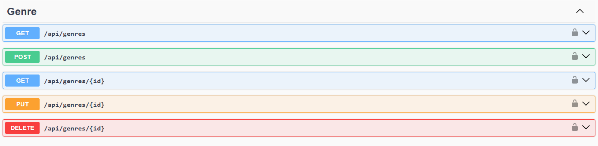
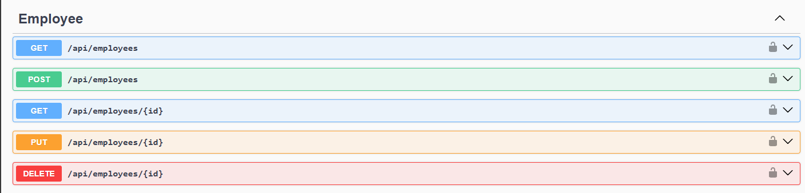

# 📚 BitLibro API

**BitLibro** es una aplicación backend RESTful desarrollada en **.NET 8** con **SQL Server** que permite gestionar préstamos de libros mediante un sistema basado en roles: `Admin`, `Employee` y `Client`.

## 🚀 Tecnologías utilizadas

- .NET 8
- Entity Framework Core (EF Core)
- SQL Server
- ASP.NET Core Identity
- JWT (JSON Web Tokens)
- FluentValidation
- Swagger (Swashbuckle)

## 📦 Paquetes NuGet

```xml
<PackageReference Include="FluentValidation.AspNetCore" Version="11.3.1" />
<PackageReference Include="FluentValidation.DependencyInjectionExtensions" Version="12.0.0" />
<PackageReference Include="Microsoft.AspNetCore.Authentication.JwtBearer" Version="8.0.17" />
<PackageReference Include="Microsoft.AspNetCore.Identity.EntityFrameworkCore" Version="8.0.17" />
<PackageReference Include="Microsoft.EntityFrameworkCore.Design" Version="9.0.6" />
<PackageReference Include="Microsoft.EntityFrameworkCore.SqlServer" Version="9.0.6" />
<PackageReference Include="Microsoft.EntityFrameworkCore.Tools" Version="9.0.6" />
<PackageReference Include="Swashbuckle.AspNetCore" Version="6.6.2" />
```

## 🧑‍🤝‍🧑 Roles definidos

- Admin.
- Employee.
- Client.

## 🔐 Base de datos


## 🔐 Módulo de Autenticación

Incluye los siguientes endpoints:

- `POST /api/auth/login`: Inicio de sesión con validación usando FluentValidation.
- `POST /api/auth/logout`: Cierre de sesión.
- `GET /api/auth/me`: Obtención de información del usuario autenticado.


### 🔐 Endpoints principales

### 📌 Módulo Auth (/api/auth)

| Método | Ruta               | Descripción                       | Requiere JWT |
| ------ | ------------------ | --------------------------------- | ------------ |
| POST   | `/api/auth/login`  | Login de usuario                  | ❌           |
| POST   | `/api/auth/logout` | Cerrar sesión (invalida el token) | ✅           |
| GET    | `/api/auth/me`     | Obtener datos del usuario actual  | ✅           |

### Digrama de caso de uso


## 👻 Módulo de Géneros

Incluye los siguientes endpoints:

- `GET /api/genre`: Ver géneros (se puede filtar por Name y paginar con Page - PageSize ).
- `GET /api/genre/{id}`: Ver un género.
- `POST /api/genre`: Crear género con validación usando FluentValidation.
- `PUT /api/genre/{id}`: Editar género con validación usando FluentValidation.
- `DELETE /api/genre/{id}`: Eliminar género.



### 🔐 Endpoints principales

### 📌 Módulo Género (/api/genre)

| Método | Ruta               | Descripción        | Requiere JWT | Admin | Employee |
| ------ | ------------------ | ------------------ | ------------ | ----- | -------- |
| GET    | `/api/genres/`     | Ver géneros        | ✅           | ✅    | ❌       |
| GET    | `/api/genres/{id}` | Ver un género      | ✅           | ✅    | ❌       |
| POST   | `/api/genres/`     | Crear género       | ✅           | ✅    | ❌       |
| PUT    | `/api/genres/{id}` | Editar un género   | ✅           | ✅    | ❌       |
| DELETE | `/api/genres/{id}` | Eliminar un género | ✅           | ✅    | ❌       |

### Digrama de caso de uso


## 📌 Módulo de Empleados

Incluye los siguientes endpoints:

- `GET /api/employee`: Ver empleados (se puede filtar por Name, LastName y paginar con Page - PageSize ).
- `GET /api/employee/{id}`: Ver un empleado .
- `POST /api/employee`: Crear empleado con validación usando FluentValidation.
- `PUT /api/employee/{id}`: Editar empleado con validación usando FluentValidation.
- `DELETE /api/employee/{id}`: Eliminar empleado.



### 🔐 Endpoints principales

### 📌 Módulo Género (/api/employee)

| Método | Ruta                 | Descripción          | Requiere JWT | Admin | Employee |
| ------ | -------------------- | -------------------- | ------------ | ----- | -------- |
| GET    | `/api/employee/`     | Ver empleado         | ✅           | ✅    | ❌       |
| GET    | `/api/employee/{id}` | Ver un empleado      | ✅           | ✅    | ❌       |
| POST   | `/api/employee/`     | Crear empleado       | ✅           | ✅    | ❌       |
| PUT    | `/api/employee/{id}` | Editar un empleado   | ✅           | ✅    | ❌       |
| DELETE | `/api/employee/{id}` | Eliminar un empleado | ✅           | ✅    | ❌       |

### Digrama de caso de uso


## 📦 Instalación y configuración

1. **Clona el repositorio:**

```bash
git clone https://github.com/JeanDev-10/APP-BITLIBRO.git
cd APP-BITLIBRO/API/API-BITLIBRO
```

2. **Configura _appsettings.json_:**
   Debes agregar las claves JWT, conexión a base de datos y los orígines permitidos:

```json
"ConnectionStrings": {
    "DefaultConnection": "Your-default-connection"
  },
  "JWTSettings":{
    "SecretKey":"your-256-bit-secret",
    "Audience":"https://localhost:4200",
    "Issuer":"https://localhost:5188",
    "TokenExpirationInMinutes": 60
  },
  "AllowedOrigins":[
    "http://localhost:4200"
  ]
```

3. **Instala dependecias y construye**
```bash
dotnet restore
dotnet build
```

4. **Ejecuta las migraciones:**

```bash
dotnet ef database update
```

5. **Ejecuta el proyecto:**

```bash
dotnet run
```

---

Acceder a la documentación:
Abrir en navegador: http://localhost:5188/swagger


---
## Autor
- [Jean Pierre Rodríguez Zambrano](https://github.com/JeanDev-10)
---
